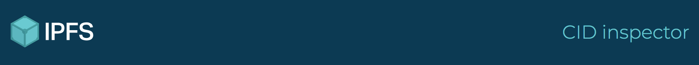

# IPFS UI Style Guide

A shared style guide for UI design in the IPFS universe.

Reuse these [colors](#colors), [typography](#typography), and [spacing](#spacing) values to create a coherent feel across all IPFS applications.

## Getting started

These examples use [tachyons] and [ipfs-css]. Using the [Parcel] bundler you can create a index.css file and simply import them.

```css
@import tachyons;
@import ipfs-css;
```

If you're using webpack or [create-react-app] you can install them from npm and import them from `node_modules`. Assuming your index.css lives in `/src` you would import them like:

```css
@import "../node_modules/tachyons";
@import "../node_modules/ipfs-css";
```

`ipfs-css` comes bundled [InterUI] and [Montserrat] woff2 files when installed from npm. If you are using [Parcel] or [create-react-app] then the font files will be copied into your project automatically.

Otherwise you will need to copy them from your `node_modules` and ensure the paths in the `@font-face` definitions are correct. It may be simpler to copy the [`@font-face` definitions](https://github.com/ipfs-shipyard/ipfs-css/blob/master/ipfs.css#L8-L104) from [ipfs-css] override them in your `index.css` file to point to where you have copied the fonts to.

## Examples

#### Header

```html
<header class="flex items-center pa3 bg-navy">
  <a href="https://ipfs.io" title="home" class="w-50">
    
  </a>
  <h1 class="w-50 ma0 tr f3 fw2 montserrat aqua">CID inspector</h1>
</header>
```



Where

```html
<header class="flex items-center pa3 bg-navy">
```

Gives us a container with [flexbox](http://tachyons.io/docs/layout/flexbox/) powers, vertically centered children via `items-center` and a dark blue, `bg-navy` background.


```html
<h1 class="w-50 ma0 tr f3 fw2 montserrat aqua">CID inspector</h1>
```

Gives us the `aqua` blue text in fancy `montserrat` font. The font-weight is `fw2` (_200 - Extra Light_) and font size `f3` on our [type scale](#typography), which is `24px` olde raster units.

It's given a 50% width with `w-50` and the text aligns to the right with `tr`. It's given a semanticaly pleaseing `h1` tag, but we don't want the usual jumbo bottom margin that headers get, so we zero out the margins with `ma0` which reads "margin, all sides, zero".


## Colors


### Fancy hero header gradient

| from `#043b55`| to `#041727` |
|------|----|
|  | 

As CSS rule

```css
.ipfs-gradient-1 {
  background:linear-gradient(to top, #041727 0%,#043b55 100%);
}
```

Rendered example


## Typography

For general instructional text we use [InterUI] as our default sans-serif font.

```css
.sans-serif {
  font-family: 'Inter UI', -apple-system, BlinkMacSystemFont, "Segoe UI", Roboto, "Helvetica Neue", Arial, sans-serif, "Apple Color Emoji", "Segoe UI Emoji", "Segoe UI Symbol";
}
```

See:
- https://css-tricks.com/snippets/css/system-font-stack/
- https://github.com/twbs/bootstrap/blob/e57a2f244ba8446fffe71847e6a58b18f7b2d541/scss/_variables.scss#L251
- Use the font stack above rather than the `system-ui` font-family because of [issues](https://infinnie.github.io/blog/2017/systemui.html)

For main headers with an IPFS feel we use [Montserrat], as in the [example](#examples) above

```css
.montserrat {
  font-family: 'Montserrat', 'Verdana', sans-serif;
}
```

### Font size

Use a type scale to pick a small set of font sizes that work together. The [tachyons type scale] is good.

Note: `rem` values assuming `16px` root font size

| class name | px   | rem    | Example
| ----------:|-----:|:-------|----------
|      `.f1` |   48 | 3      | Main header `<h1 class="f1">`
|      `.f2` |   36 | 2.25   | Sub head `<h2 class="f2">`
|      `.f3` |   24 | 1.5    | `<h3 class="f3">`
|      `.f4` |   20 | 1.25   | `<h3 class="f4">`
|      `.f5` |   16 | 1      | General copy `<p class='f5'>`
|      `.f6` |   14 | 0.875  | Small header `<h4 class="f6 b uppercase">`
|      `.f7` |   12 | 0.75   | Small print `<small class='f7'>`

Capturing the font sizes for your app as isolated, single purpose css classes, adds flexibility by decoupling your design from your markup semantics. An `<h1>` doesn't have to be the largest text on the page.

Agreeing to a finite set of font sizes prevents the font-size sprawl that often occurs when trying to maintain a ui and associated css over time. (GitHub, at time of writing has **56 unique font sizes** defined: [github cssstats](http://cssstats.com/stats?url=http%3A%2F%2Fgithub.com&ua=Browser%20Default))

### Headers and Heros

Sometimes you need really big text, for fancy splash pages and hero sections.

| class name       | px   | rem  | Example
| ----------------:|-----:|:-----|----------
| `.f-headline`    |   48 | 6    | Hero headline `<h1 class="f-headline">`
| `.f-subheadline` |   36 | 5    | `<h2 class="f-subheadline">`

These are just there to help get things done quickly. Use whatever font-size the design calls for. If the it's a one time use for a big impact intro, then just use an inline style.

## Spacing

Use a spacing scale to define a finite set of margin and padding sizes.

Using a scale gives a layout coherence and pinning the possible values to a fixed set avoids littering the stylesheet with magic numbers. Reusing the same spacing values creates vertical rhythm.

Capturing your spacing values as single purpose css classes allows you to quickly adjust layouts without side effects. You can modify the use site in the DOM without the risk of breaking another part of the UI.

The tachyons spacing scale is:

| class name  | px   | rem   | CSS declaration
| -----------:|-----:|:------|--------------------
|      `.pa0` |   0  | 0     | `padding: 0`
|      `.pa1` |   4  | 0.25  | `padding: 0.25rem`
|      `.pa2` |   8  | 0.5   | `padding: 0.5rem`
|      `.pa3` |  16  | 1     | `padding: 1rem`
|      `.pa4` |  32  | 2     | `padding: 2rem`
|      `.pa5` |  64  | 4     | `padding: 4rem`
|      `.pa6` | 128  | 8     | `padding: 8rem`
|      `.pa7` | 256  | 16    | `padding: 16rem`

See: http://tachyons.io/docs/layout/spacing/

The class names follow a simple structure. They start with either:

- `m` for **margin**. `ma0` is `margin: 0`
- `p` for **padding**. `pa3` is `padding: 1rem`

followed by a _direction_

- `a` for **all**. `pa3` is `padding: 3rem`
- `h` for **horizontal**, so left and right. `mh3` is `margin-left: 1rem; margin-right: 1rem;`
- `v` for **vertical**. `pv3` is `padding-top: 1rem padding-bottom: 1rem;`
- `l` is **left**, `r` is **right**. `pl3` is `padding-left: 1rem;`
- `t` is **top**, `b` is **bottom**. `mt3` is `margin-top: 1rem;`

followed by a _size_ from the scale, so:

```html
<div class='mb3 pa2'>Woo woo</div>
```

- `mb3`: margin bottom 3 = `margin-bottom: 1rem`
- `pa2`: margin all 2 = `padding: 0.5rem`

Further reading:

- http://tachyons.io/docs
- https://github.com/dwyl/learn-tachyons

## Credits

This style guide is heavily based on http://tachyons.io/

## License

This repository is mainly for documents. All of these are licensed under the [CC-BY-SA 3.0](https://ipfs.io/ipfs/QmVreNvKsQmQZ83T86cWSjPu2vR3yZHGPm5jnxFuunEB9u) license © 2016 Protocol Labs Inc. Any code is under an [MIT license](LICENSE) © 2016 Protocol Labs Inc.


[ipfs-css]: https://github.com/ipfs-shipyard/ipfs-css
[ipfs.io]: https://ipfs.io
[tachyons]: http://tachyons.io
[tachyons type scale]: http://tachyons.io/docs/typography/scale
[Parcel]: https://parceljs.org
[create-react-app]: https://github.com/facebook/create-react-app
[Montserrat]: https://github.com/JulietaUla/Montserrat
[InterUI]: https://github.com/rsms/inter
